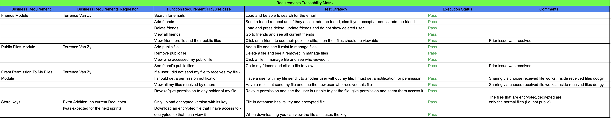
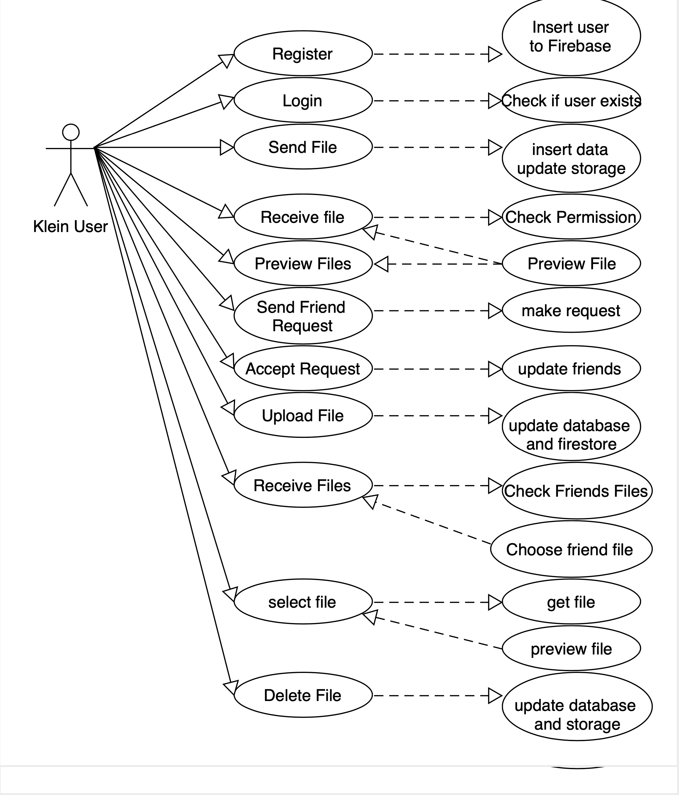

# SD All diagrams
- [SD All diagrams](#sd-all-diagrams)
- [Diagrams](#diagrams)
  - [Logical View](#logical-view)
    - [State Diagram](#state-diagram)
    - [Class Diagram](#class-diagram)
  - [Development View](#development-view)
    - [Component Diagram](#component-diagram)
  - [Process View](#process-view)
    - [Activity Diagram](#activity-diagram)
    - [Sequence Diagram](#sequence-diagram)
  - [Physical View](#physical-view)
- [Traceable (Functional and non functional)](#traceable-functional-and-non-functional)
- [Actor Diagram](#actor-diagram)
# Diagrams

## Logical View

### State Diagram

### Class Diagram

## Development View

### Component Diagram

## Process View

### Activity Diagram

### Sequence Diagram

Send Files

Receive Files

FriendsList

My Sent Files

## Physical View

# Traceable (Functional and non functional)

# Actor Diagram

